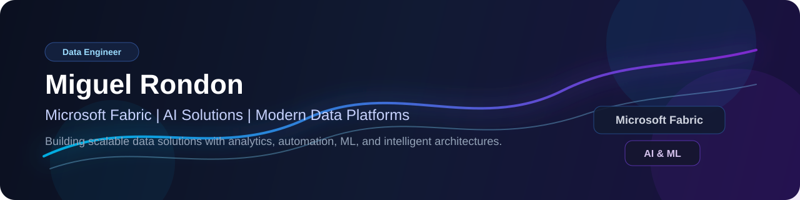

  

# Miguel Rondon | Data Engineering & AI Solutions 👋

### Building modern data platforms with Microsoft Fabric, AI, ML, and intelligent automation
### Construyendo plataformas de datos modernas con Microsoft Fabric, IA, ML y automatización inteligente

---

## 🌐 Overview | Resumen

**EN**  
Data Engineer at **BPT**, specialized in **Microsoft Fabric**, focused on building modern, scalable, and business-oriented data solutions. I combine data engineering and artificial intelligence to design smarter analytical processes, optimized data flows, and enterprise-ready architectures.

**ES**  
Ingeniero de Datos en **BPT**, especializado en **Microsoft Fabric**, enfocado en diseñar soluciones de datos modernas, escalables y orientadas al negocio. Combino ingeniería de datos e inteligencia artificial para crear procesos analíticos más inteligentes, flujos de datos optimizados y arquitecturas empresariales modernas.

## 🚀 Core Stack | Tecnologías principales

## 💡 What I do | Lo que hago

**EN**  
I design and implement **AI-optimized data flows**, integrating analytics, automation, ETL/ELT, machine learning, and data agents to create modern enterprise technology solutions.

**ES**  
Diseño e implemento **flujos de datos optimizados con inteligencia artificial**, integrando analítica, automatización, ETL/ELT, machine learning y agentes de datos para crear soluciones tecnológicas empresariales modernas.

## 🎯 Focus Areas | Áreas de enfoque

- Microsoft Fabric and modern data platforms  
- Data engineering and scalable architectures  
- ETL/ELT and advanced analytics  
- AI applied to business processes  
- Machine learning and intelligent automation  
- Graph-based solutions and relationship modeling

## 🌱 Currently | Actualmente

**EN**
- Specializing in **Microsoft Fabric**
- Pursuing a **Master’s degree in Artificial Intelligence**
- Exploring **ML, data agents, and graph-based solutions** in enterprise environments

**ES**
- Especializándome en **Microsoft Fabric**
- Cursando una **maestría en Inteligencia Artificial**
- Explorando aplicaciones de **ML, agentes de datos y grafos** en entornos empresariales

## 📊 GitHub Activity | Actividad en GitHub

**EN**  
I am continuously strengthening my portfolio with projects focused on data engineering, Microsoft Fabric, and applied artificial intelligence.

**ES**  
Estoy fortaleciendo continuamente mi portafolio con proyectos enfocados en ingeniería de datos, Microsoft Fabric e inteligencia artificial aplicada.

## 📌 Featured Projects | Proyectos destacados

**EN**  
I will soon be sharing projects here related to:
- Data engineering
- Microsoft Fabric solutions
- Artificial intelligence applied to business processes
- Automation and advanced analytics

**ES**  
Próximamente estaré compartiendo aquí proyectos relacionados con:
- Ingeniería de datos
- Soluciones con Microsoft Fabric
- Inteligencia Artificial aplicada a procesos empresariales
- Automatización y analítica avanzada

## 📫 Connect with me | Conecta conmigo

